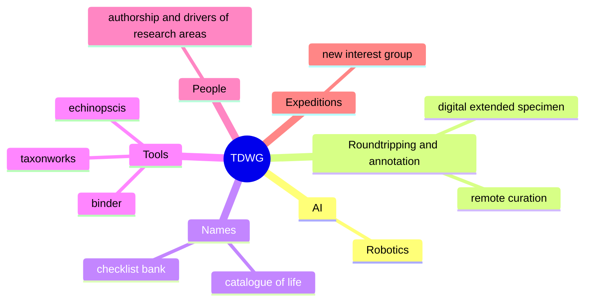

TDWG 2023 was held in Hobart, Australia between 9th and 13th October.

## Monday

### Contributed oral session

## Tuesday

### Roundtripping session

### Keynote - [[Tim Sherratt|Tim Sherratt]]

## Thursday

## Friday

### Contributed oral session

### Unconference
